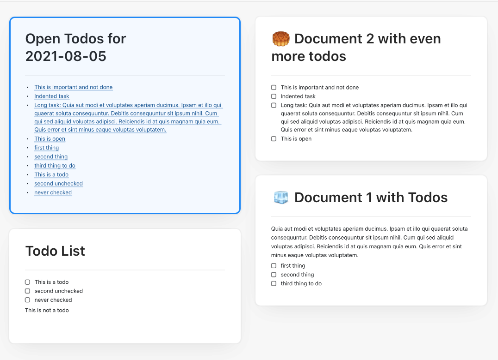

# Craft Collect Todos

A simple script for the [Craft](https://www.craft.do/) notes app that collects open todos from all documents.

## Requirements

* Python 3.9.5+
* [pync](https://pypi.org/project/pync/) : `$ pip install pync` or, if you do not need a notification, remove the call. 

## Installation

1. Download the script
2. Set the library path in **craft-collect-todos.py** 

## Usage 

* Run `$ python craft-collect-todos.py` to create a new collection of todos

## Caveats

* Craft does not have an API, so i am parsing the json files. Changes to their format will probably break the parser.
* Only tested with [External storage](https://www.craft.do/getting-started/b/A9629D59-881C-4785-822F-15BC6FAEEAEF/💻_Using_Local_Storage) (iCloud drive) libraries. 
* Not tested with huge Craft libraries 

